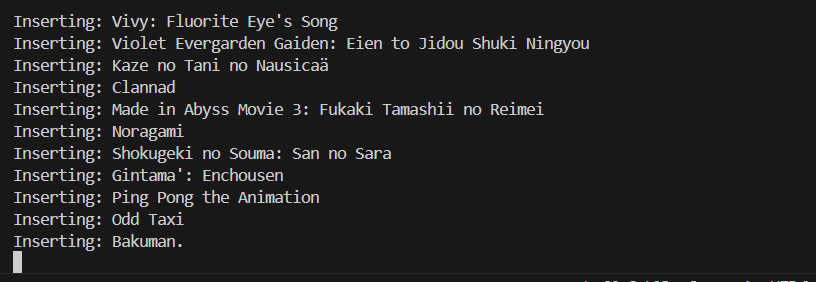

# Anime Search App Using Weaviate and Gradio


This project demonstrates how to build a simple anime search application using **Weaviate** for vector search and **Gradio** for creating an interactive UI. The app allows users to search for anime using embeddings stored in a Weaviate database.

---

## Prerequisites

Before getting started, ensure you have the following installed on your system:

- Python (3.10.6)
- Docker and Docker Compose

---

## Installation

Follow these steps to set up and run the application:

### 1. Install Required Python Libraries

Run the following command to install the necessary Python dependencies:

```bash
pip install weaviate-client pandas
```

### 2. Start Weaviate Using Docker

Use Docker Compose to spin up a Weaviate instance:

```bash
docker-compose up
```

This will start a local Weaviate server that will store and manage the anime data.

### 3. Preprocess the Dataset (Optional)
This dataset has been preprocess so you don't need to run this. But if you want to preprocess a custom dataset, modify the `clean-dataset.py` file according to your needs. Once modified, run the script:

```bash
python clean-dataset.py
```

The original dataset from: https://www.kaggle.com/datasets/andreuvallhernndez/myanimelist-jikan
### 4. Create a Collection in Weaviate

Run the following script to create the anime collection and insert the dataset into the Weaviate instance:

```bash
python create-collection.py
```

Wait for the data to be inserted into Weaviate. Once the process is complete, you should see output similar to this:



This process taking pretty much time depend on your dataset.

### 5. Launch the Anime Search App

Run the search application:

```bash
python search-anime.py
```

After the script starts, you’ll see a local URL (e.g., `http://127.0.0.1:7860`). Open this URL in your browser to interact with the app.


enjoy


